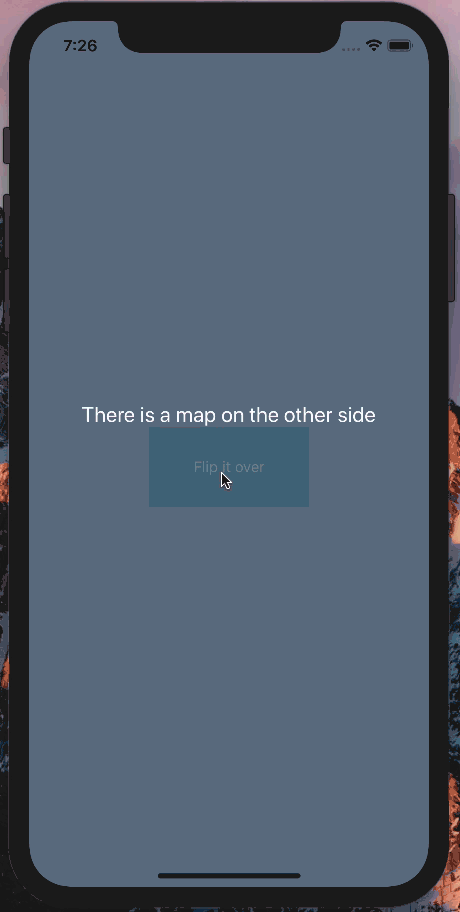

# react-native-flip-component

### Installation
`npm install react-native-flip-component --save`

### Instructions
Pass a boolean, front component, and back component as props. The boolean will determine if the front or back component should be displayed.

### Demo
To see the code from this GIF, check out `example.js` in the repo on GitHub.


### Props
Name | Required? | Description
---- | ----------|--------
isFlipped | true | Boolean that controls if the view is flipped.
frontView | true | Component for the front view.
backView | true | Component for the back view.
scale | false | Controls if the view zooms in or out while flipping. Defaults to 0.8
scaleDuration | false | Controls how quickly the scale changes. Defaults to 100
frontPerspective | false | Controls the perception of depth for the front component. Defaults to 1000
backPerspective | false | Controls the perception of depth for the back component. Defaults to 1000
rotateDuration | false | Controls the duration of the rotation. Defaults to 300
containerStyles | false | Styles for the flip-component's container `<View>`. Defaults to null
frontStyles | false | Styles for the `<Animated.View>` that wraps the front component. Defaults to null
backStyles | false | Styles for the `<Animated.View>` that wraps the back component. Defaults to null

### Example

```javascript
import React, { Component } from 'react';
import FlipComponent from 'react-native-flip-component';
import { View, Button, Text } from 'react-native';

class Example extends Component {
  constructor(props) {
    super(props);
    this.state = {
      isFlipped: false;
    };
  }
  render() {
    <View>
      <FlipComponent
        isFlipped={this.state.isFlipped}
        frontView={
          <View>
            <Text style={{ textAlign: 'center' }}>
              Front Side
            </Text>
          </View>
        }
        backView={
          <View>
            <Text style={{ textAlign: 'center' }}>
              Back Side
            </Text>
          </View>
        }
      />
      <Button
        onPress={() => {
          this.setState({ isFlipped: !this.state.isFlipped })
        }}
        title="Flip"
      />
    </View>
  }
}

```
